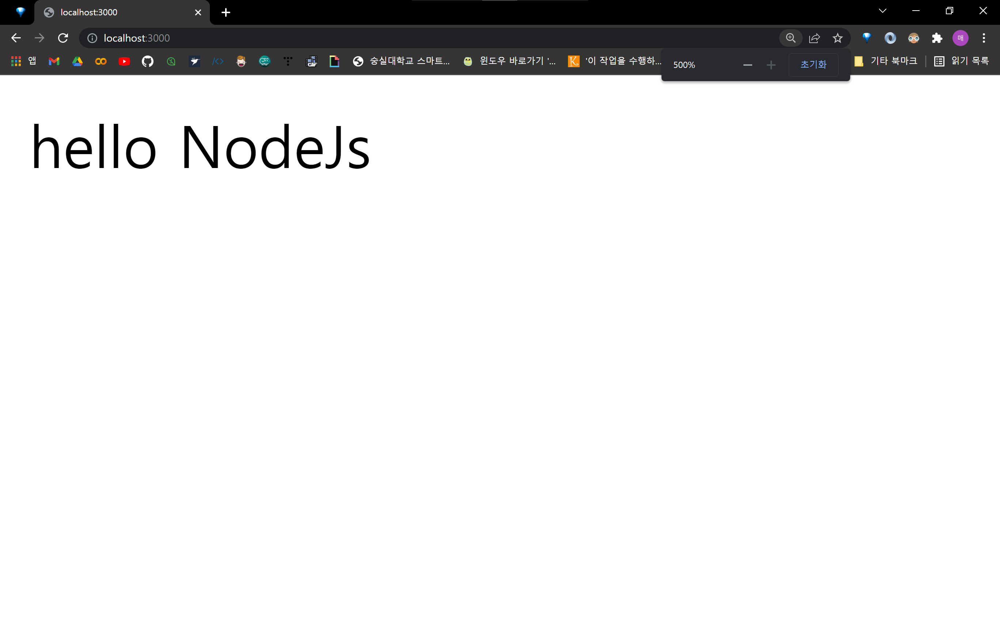

# Node JS 첫 입문을 기념합니다.
---

## 1. 과정
### 1. npm init
* package.json 생성
    ```shell
    > cd _프로젝트파일_
    _프로젝트파일_ > npm init
    ```
* package.json 설정
  * 사실 엔터만 눌러도 알아서 넘어가지만..
  * 프로젝트의 정보를 명확히 써보자는 의미로 한번 작성함
    ```json
    {
        "name": "first-project",
        "version": "1.0.0",
        "description": "use of nodejs",
        "main": "index.js",
        "scripts": {
            "test": "echo \"Error: no test specified\" && exit 1"
        },
        "author": "",
        "license": "ISC",
        "dependencies": {
            "express": "^4.17.3"
        }
    }
    ```
### 2. npm install
* express 모듈 설치
    ```shell
    > npm install --save express
    ```

### 3. app.js 생성
* 패키지의 메인 파일이라 생각
  * JSON에서 main이 될것이라 생각 
    ```js
    const express = require('express');
    const app = express();

    app.get(
        '/', 
        function(req, res){
            res.send('hello NodeJs');
        }
    )

    app.listen(
        3000, 
        () => console.log("3000번 포트 대기")
    );
    ```

---

## 2. 결과
``` shell
PS D:\강의\마크다운\병특준비\NodeJs\NodeJs실습\NodeJs_Project> node app
```


---

### 참고한 블로그
https://developerm.tistory.com/143

> **시작이 반이다.**
> 정말 대단한걸 한 것은 아니다. 그래도,
> 컴함 1학년 때 C로 "Hello World" 띄워본 이후 지금까지 많은 발전이 있었듯.
> 이 Node JS 입문이 한 발짝 더 나아간 것 같다 생각 ㅋㅋㅋㅋ;
